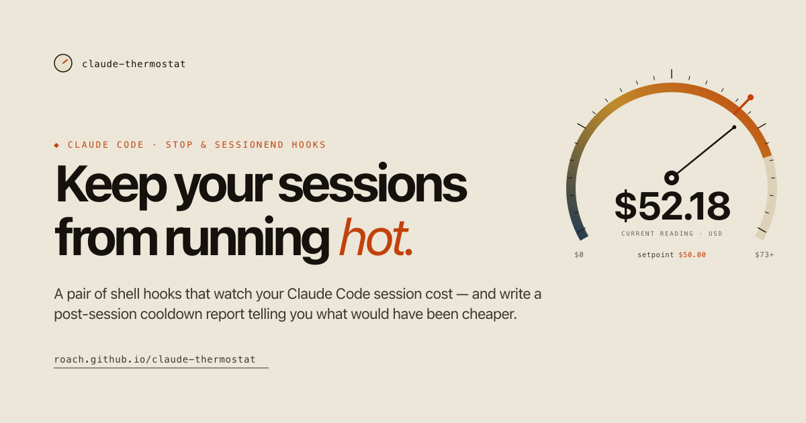

# claude-thermostat

[](https://roach.github.io/claude-thermostat/)

**[→ Read the docs at roach.github.io/claude-thermostat](https://roach.github.io/claude-thermostat/)**

A Claude Code hook that watches session cost and prompts you to `/compact`, `/clear`, or pivot before the bill balloons — plus a post-session **cooldown report** with cost-reduction suggestions for next time.

The metaphor is precise: a thermostat. Setpoint (`$CLAUDE_THERMOSTAT_COST_CENTS`), sensor (transcript parser), actuator (the alert), hysteresis (cooldown turns).

## What it does

Fires on every `Stop` event (when Claude finishes responding). Tracks:

- **Session age** — wall-clock time since the first turn
- **Turn count** — completed back-and-forth exchanges
- **Estimated cost** — parsed from the session transcript JSONL, using actual token counts and per-model pricing (Fable, Opus, Sonnet, Haiku). Deduplicates re-appended assistant messages by `message.id` so the estimate matches what Anthropic actually bills.
- **Context window size** — total input tokens on the most recent turn
- **Cache hit %** — share of input tokens that hit cache (higher = cheaper turns)

A sudden **per-turn cache drop** (≥30 percentage points below the session average) is detected as an always-on signal — it fires without a setpoint, flagging a context reshuffle that just made the next turn much more expensive.

When the cost setpoint is crossed (or an antipattern is detected — see below), the hook exits `2`, which makes Claude surface the alert and ask the user what they'd like to do. After firing it re-arms after `CLAUDE_THERMOSTAT_COOLDOWN_TURNS` more turns (the deadband), so long sessions get periodic nudges without constant interruption.

## Files

- `claude-thermostat.sh` — the in-session alert, wired to `Stop`
- `cooldown-report.sh` — the post-session cost-reduction post-mortem, wired to `SessionEnd`
- `thermostat-status.sh` — on-demand status query; used by the `/thermostat` skill
- `weekly-trend.sh` — 7-day (or N-day) cost/antipattern trend from cooldown reports
- `project-audit.sh` — aggregate cooldown reports across all sessions for a project, surfacing recurring skill candidates, bash patterns, and structural gaps
- `context-audit.sh` — static audit of the always-on context surface (CLAUDE.md files, rules, skill/agent descriptions, MCP servers); used by the `/thermostat-audit` skill
- `idle-notify.sh` — optional `Notification`-hook desktop alert when Claude is blocked waiting on input
- `print-latest-cooldown.sh` — optional terminal pretty-printer for the report (call from a `claude` shell wrapper after the process exits)
- `_lib.py` — shared pricing, dedup, and session-filter helpers
- `skills/thermostat.md` — Claude Code skill for `/thermostat`
- `skills/thermostat-week.md` — Claude Code skill for `/thermostat-week`
- `skills/thermostat-project.md` — Claude Code skill for `/thermostat-project`
- `skills/thermostat-audit.md` — Claude Code skill for `/thermostat-audit`
- `skills/thermostat-checkpoint.md` — Claude Code skill for `/thermostat-checkpoint` (handoff primer + fresh-session ritual)
- `skills/deterministic-toolkit.md` — remediation skill for the "inline deterministic work" detector: route mechanical data work to scripts
- `docs/report-format.md` — stable format spec for `reports.log` and cooldown report files

## Session state

Per-session JSON lives at `~/.claude/thermostat/<session_id>.json`:

```json
{ "session_start": 1778825375, "turn_count": 15, "last_nag_turn": 15, "nag_count": 1 }
```

Safe to delete — recreated on next session.

## Configuration

| Env var | Default | Meaning |
|---|---|---|
| `CLAUDE_THERMOSTAT_COST_CENTS` | `5000` | Cost setpoint (US cents, $50). Subscription users (Max / Pro / Team / Enterprise) should consider setting this to `0` and using `CLAUDE_THERMOSTAT_WINDOW_TOKENS` as the primary setpoint instead, since dollars aren't what Anthropic charges against their quota. |
| `CLAUDE_THERMOSTAT_TIME_SEC` | `0` | Session-age setpoint in seconds; `0` disables |
| `CLAUDE_THERMOSTAT_TURNS` | `0` | Turn-count setpoint; `0` disables |
| `CLAUDE_THERMOSTAT_CONTEXT_K` | `0` | Last-turn input-context setpoint (K tokens); `0` disables |
| `CLAUDE_THERMOSTAT_CACHE_HIT_MIN` | `0` | Cache-hit-% setpoint; fires when the session cache hit rate falls below this value (requires ≥3 turns). `0` disables. |
| `CLAUDE_THERMOSTAT_COOLDOWN_TURNS` | `10` | Deadband: turns between re-fires after first |
| `CLAUDE_THERMOSTAT_ANTIPATTERNS` | `1` | Set to `0` to disable antipattern detection |
| `CLAUDE_THERMOSTAT_COST_MODE` | `api` | `api` includes `cache_read` at 0.1× input (matches Anthropic's published API rates). `subscription` (alias: `claude-code`) excludes `cache_read`, matching the cost number Claude Code shows in its statusline for Max / Pro / Team / Enterprise plans. See [Cost modes](#cost-modes) |
| `CLAUDE_THERMOSTAT_WINDOW_SEC` | `18000` | Rolling-window length in seconds (default 5h) |
| `CLAUDE_THERMOSTAT_WINDOW_TOKENS` | `0` | Token setpoint across the rolling window; `0` disables. See [Subscription window](#subscription-window-approximation) |
| `CLAUDE_THERMOSTAT_WINDOW_COUNT_CACHED` | `1` | `1` weights `cache_read` at 1.0x in the window sum; `0` excludes it |
| `CLAUDE_THERMOSTAT_AUTODELEGATE_K` | `0` | Context threshold (K tokens) at which the nag *instructs* Claude to automatically route the next exploration task to a subagent, rather than just offering it as an option. `0` = soft suggestion only. Recommended: `150` |
| `CLAUDE_THERMOSTAT_SUBAGENT_MODEL` | `` | Model ID passed to the auto-delegate instruction (e.g. `claude-haiku-4-5-20251001`). Empty = no model hint; Claude picks the session default. Set to a cheaper model to cut subagent cost. |
| `CLAUDE_THERMOSTAT_CONFIG` | `~/.claude/thermostat/config.env` | Path to optional config file |

### Config file

Instead of (or in addition to) env vars, drop a shell-style config at `~/.claude/thermostat/config.env`. The hook sources it on every invocation, so values take effect immediately:

```sh
# ~/.claude/thermostat/config.env
CLAUDE_THERMOSTAT_COST_CENTS=3000     # fire at $30 instead of $50
CLAUDE_THERMOSTAT_COOLDOWN_TURNS=15
CLAUDE_THERMOSTAT_CONTEXT_K=120
```

The config file is sourced before defaults, so its values override any env vars in the calling environment. To temporarily override, edit the file or set `CLAUDE_THERMOSTAT_CONFIG=/dev/null` to skip it entirely.

## Wiring (`~/.claude/settings.json`)

```json
"Stop": [
  {
    "hooks": [
      {
        "type": "command",
        "command": "/abs/path/to/claude-thermostat/claude-thermostat.sh"
      }
    ]
  }
]
```

## Suggested actions the alert offers

- **`/compact`** — summarizes history and shrinks the context window. Best when the task is ongoing and context is large. Shown when context is at or above `CLAUDE_THERMOSTAT_CONTEXT_K`.
- **Delegate to a subagent** — shown whenever context reaches 50K+ tokens, regardless of what triggered the alert. Subagents run in their own context window, so their Read/Bash/Grep output never lands in the main thread — subsequent main-thread turns stay cheaper. For this to actually save tokens, _accept the subagent's summary_ instead of re-running the same reads in the main thread to "verify" it; if the summary is thin, re-delegate with a sharper prompt rather than falling back to direct exploration. (A companion `~/.claude/CLAUDE.md` rule enforces this no-fallback discipline.)
- **Lower `autoCompactThreshold`** — shown when context reaches 50K+ tokens and the current threshold is above 0.75 (or unset, implying the ~0.90 default). Selecting it sets `autoCompactThreshold: 0.70` in `~/.claude/settings.json` so Claude Code compacts automatically before context bloat compounds across future sessions.
- **`/model sonnet`** — shown when running a premium-tier model; Sonnet is ~1.7× cheaper than Opus and ~3.3× cheaper than Fable on both input and output.
- **`/clear`** — wipes context entirely. Best when pivoting to a new sub-task.
- **Close and reopen** — fully new session, lowest cost baseline. Best when the current task is done.
- **Continue** — dismiss and keep going. The hook re-arms after `COOLDOWN_TURNS` more turns.

## Cooldown report

`cooldown-report.sh` runs once on `SessionEnd` and writes a markdown report to `~/.claude/thermostat/reports/<session_id>.md`, plus a one-line entry in `~/.claude/thermostat/reports.log`.

The report includes:

- Cost, duration, turn count, per-model breakdown, token totals
- **Cache hit %** — higher is cheaper; <40% suggests context churn (big auto-loading rules, frequent /clear)
- **Skill candidates** — files Read 3+ times, URLs WebFetched 2+ times, Grep patterns repeated 3+ times. These are reference material that should live in a skill.
- **Tool choice** — if Grep/Read/Glob dominated, suggests `mcp__auggie__codebase-retrieval` for natural-language lookups; if context grew large with no subagent use, suggests delegating. (Auggie is one example — the detector fires on the grep-chain pattern, not the tool; any codebase-retrieval MCP or a pre-built code index like [codegraph](https://github.com/colbymchenry/codegraph) addresses it.)
- **Model choice** — if Opus dominated cost and produced many small outputs, flags downgrade candidates.
- **Model switches mid-session** — flags any model change that resets the KV cache, naming the turn and models, and explains the per-turn cost penalty on cache-cold turns.
- **Prompt patterns** — many short prompts → suggests one-shot patterns per Anthropic's Opus 4.7 best-practices.
- **Long, hot session** — when a session ran ≥20 turns and ended near the auto-compaction threshold (>140K context), suggests the checkpoint ritual (commit + push, then start fresh) so git history carries context forward instead of riding a lossy compacted transcript — or steering `/compact <what to keep>` if you'd rather continue.
- **Multi-day session** — a session whose wall-clock span reached 12+ hours across ≥10 turns. Distinct from the context-size check above: this fires on staleness even when context stayed modest, because every idle gap past the 5-minute cache TTL restarts the cache cold and the transcript keeps re-billing as it ages.
- **Extended thinking** — heavy thinking use (≥20 thinking blocks with >60K output tokens) flags that thinking bills as output; suggests lowering reasoning effort with `/effort` or `MAX_THINKING_TOKENS` for routine work.
- **MCP surface** — when ≥2 MCP servers (or ≥8 MCP calls) were used, points you at `/context` to see per-server cost, `/mcp` to disable idle servers, and CLI equivalents (`gh`, `aws`, `gcloud`) that add no per-tool listing.
- **`.claudeignore` candidates** — repeated reads/greps into build or dependency dirs (`node_modules`, `dist`, `build`, …) suggests excluding them so they stop burning context.
- **Inline deterministic work** — ≥2 turns with ≥4000 output tokens and no Bash/Write/Edit suggests the model computed or reformatted data inline instead of scripting it; points to a deterministic-toolkit skill for mechanical work (parsing, converting formats, deduping, aggregating, diffing).
- **Session-start overhead** — the first API call's input+cache_write is the context loaded before your first word (CLAUDE.md, rules, memory, MCP tool schemas). Shown in the header; flagged as a suggestion when ≥30K tokens.
- **Cache expirations** — the prompt cache TTL is 5 minutes. Turns that follow a longer idle gap re-write the whole context at 1.25× input instead of reading it at 0.1×; the report counts these and estimates the dollars lost to cold restarts.
- **Failed tool calls** — ≥5 errored `tool_result`s flags round-trips burned on permission denials, blocking hooks, or bad paths that usually trace to one fixable cause.
- **Post-compact re-reads** — files read before auto-compaction and again after it were paid for twice; suggests steering `/compact <what to keep>` or checkpointing before it triggers. The header also shows how many compactions occurred.
- **Pricing changes** — flags upcoming rate flips (e.g. Sonnet 5 introductory pricing ending 2026-09-01) when they're near, so the cost jump doesn't read as a regression.
- Tool histogram for the session.

**Note:** The report filters to only the current session's turns using `session_start` from the thermostat hook's state file. If `claude-thermostat.sh` is not also enabled (i.e. no `Stop` hook), `session_start` will be 0 and the report will include all turns in the transcript file, potentially spanning multiple prior sessions.

Wire it up alongside the thermostat:

```json
"SessionEnd": [
  {
    "hooks": [
      {
        "type": "command",
        "command": "/abs/path/to/claude-thermostat/cooldown-report.sh"
      }
    ]
  }
]
```

## Recommended companion rules

The thermostat *detects* waste after the fact; a few standing rules in `~/.claude/CLAUDE.md` (or a team-shared `CLAUDE.md`) prevent the most expensive patterns up front. These three address the dominant costs found across real report corpora — long stale sessions, main-thread exploration, and turn-based micro-steering:

```markdown
## Delegate bulk exploration to subagents

For multi-file searches, log/codebase spelunking, or any read-heavy
investigation, use a subagent (Agent tool) so raw tool output stays out of
the main transcript — it re-bills on every later turn. Reserve the main
thread for decisions and edits. If the main thread has accumulated many
Reads/Greps with no subagent and context is climbing, switch to delegation.

## Checkpoint and restart long sessions

When a session passes ~25 turns or ~150K context, proactively offer to
commit + push a checkpoint and continue in a fresh session rather than
letting the transcript grow toward auto-compaction. Git history carries
context forward more cheaply than a compacted (lossy) conversation.

## Consolidate requirements before acting

When a request is ambiguous or likely to spawn many follow-up turns, gather
the full requirements up front (one AskUserQuestion round) instead of
iterating one short turn at a time — each short follow-up re-bills the
whole cached transcript.
```

The third one is worth pairing with a habit on the human side: one detailed first prompt beats many `<60`-character follow-ups, and the report's **Prompt patterns** signal will tell you when steering is dominating.

## Cost modes

`CLAUDE_THERMOSTAT_COST_MODE` controls whether `cache_read_input_tokens` are billed in the cost computation. The right value depends on your plan.

| Mode | What it bills | When to use |
|---|---|---|
| `api` (default) | input + `cache_creation` at 1.25× + `cache_read` at 0.1× + output | API pay-as-you-go. Matches Anthropic's [published pricing](https://www.anthropic.com/pricing). Conservative for everyone else. |
| `subscription` (alias: `claude-code`) | input + `cache_creation` at 1.25× + output (cache_read excluded) | Max, Pro, Team, Enterprise. Matches the cost Claude Code shows in its statusline. The dollar figure is an **API-equivalent estimate** — subscription users aren't billed per-token, and Anthropic doesn't publish the subscription quota formula. The figure is useful for orientation and comparison, but it isn't authoritative; use `CLAUDE_THERMOSTAT_WINDOW_TOKENS` for real quota tracking. |

**Why the two modes exist:** Claude Code's statusline reports cost via `cost.total_cost_usd`, which excludes `cache_read`. The Stop hook payload doesn't include that field, so the thermostat recomputes from the transcript. For a cache-heavy session, the two numbers can disagree by 2–3×. Choosing the wrong mode hides money from one side or the other:

- Subscription users on `api` mode see an inflated number that doesn't match their statusline or anything Anthropic counts. Confusing, but not financially harmful.
- API users on `subscription` (or `claude-code`) mode see a deflated number and may not realize how much they're actually spending. **Financially harmful** — this is why `api` is the default. Subscription users should opt into `subscription` (or `claude-code`) mode explicitly.

The cooldown report header always notes which mode produced the number it shows.

## Subscription-window approximation

Cost setpoints (dollars) map cleanly to API billing. Max/Pro/Team plans don't bill that way — they gate on token quotas inside rolling windows, and Anthropic doesn't expose that counter in any local file. `/usage` inside the CLI fetches it from the server at call time.

When `CLAUDE_THERMOSTAT_WINDOW_TOKENS` is set, the thermostat builds a **local approximation** of that counter by scanning every transcript under `~/.claude/projects/` and summing weighted tokens whose timestamps fall in the last `CLAUDE_THERMOSTAT_WINDOW_SEC` seconds (default 5h). The header gains a `… tok/5h` segment, the alert fires when the sum crosses the setpoint, and the cooldown report includes a per-model breakdown.

What this is good for:

- A terminal-local gut-check of "how much have I burned in the last few hours, across every session" without leaving `claude`.
- A calibration target: hit a real `/usage` cap once, compare it to the local number at that moment, and you have a multiplier for your plan.

What it can't tell you:

- The real quota state. `/usage` is still authoritative.
- Anthropic's window bucketing (sliding vs aligned to a reset boundary) — this implementation assumes a continuous rolling window.
- How cached reads are weighted against the quota. By default this counts `cache_read_input_tokens` at 1.0x as a conservative stand-in; set `CLAUDE_THERMOSTAT_WINDOW_COUNT_CACHED=0` to exclude them entirely.
- Usage from `claude.ai`, direct API calls, or anything else not written to `~/.claude/projects/`.

State for the window scan lives at `~/.claude/thermostat/window-index.json`. Safe to delete; it rebuilds on the next invocation (will re-scan transcript tails up to the configured max age).

## On-demand status (`/thermostat` skill)

`thermostat-status.sh` queries the current session without waiting for a threshold to fire. It reads the most recently modified state file in `~/.claude/thermostat/` and parses the corresponding transcript:

```
thermostat status · session a1b2c3d4

  Turns:     12
  Age:       28 min
  Cost:      $0.47  (subscription-estimated)
  Context:   43K tokens  (last turn)
  Cache hit: 78% session avg, 72% last turn
  Model:     sonnet-5

  Tokens:    in=142K  cw=12K  cr=438K  out=18K
```

A cache-drop warning appears when the most recent turn dropped ≥30pp below the session average.

### Install the skill

```bash
mkdir -p ~/.claude/skills
ln -s /path/to/claude-thermostat/skills/thermostat.md ~/.claude/skills/thermostat.md
```

Then type `/thermostat` in any Claude Code session. Claude will run the status script and summarize the output. The skill resolves the script via `$THERMOSTAT_DIR`, then PATH, then a `find` fallback.

Optionally set `THERMOSTAT_DIR` in your shell config so the skill always finds the script:

```sh
export THERMOSTAT_DIR="$HOME/path/to/claude-thermostat"
```

## Weekly trend (`/thermostat-week` skill)

`weekly-trend.sh` reads `~/.claude/thermostat/reports.log` and the individual report files to produce a day-by-day summary of sessions, cost, turns, and recurring suggestion categories:

```
thermostat weekly trend · 7 days ending 2026-05-26

Date           Sessions   Cost    Turns  Top suggestions
──────────────────────────────────────────────────────────
2026-05-26            3  $12.40      45  skill(2), context(1)
2026-05-25            5   $8.20      72  model(3), skill(1)
──────────────────────────────────────────────────────────
Total                 8  $20.60     117

Recurring suggestions: skill(3), model(3), context(1)
```

Run directly from a terminal:

```bash
./weekly-trend.sh          # last 7 days
./weekly-trend.sh 14       # last 14 days
./weekly-trend.sh --markdown   # GitHub-flavored markdown output
```

### Install the skill

```bash
ln -s /path/to/claude-thermostat/skills/thermostat-week.md ~/.claude/skills/thermostat-week.md
```

Then type `/thermostat-week` in any session. Pass a day count or `--markdown` in your message and the skill forwards it to the script.

## Project audit (`/thermostat-project` skill)

`project-audit.sh` aggregates cooldown reports across all sessions that touched a given project directory and produces a project-level post-mortem:

```
# Project audit — myapp

- Sessions analyzed: 4  (2026-05-26 → 2026-05-28)
- Total cost: $42.10  (avg $10.53/session)

## Recurring skill candidates
| File | Sessions | Total reads |
|---|---:|---:|
| /projects/myapp/docs/openapi.yaml | 3 | 14 |

## Better search tool for source files
| File | Sessions | Total reads |
|---|---:|---:|
| /projects/myapp/models.py | 2 | 9 |

## Structural gaps
- `.claudeignore` missing — add one to exclude build artifacts

## Top suggestion categories
- Skill candidates — appeared in 4/4 sessions (100%)
- Better tool choices — appeared in 2/4 sessions (50%)
```

Sessions are matched to the project by looking for the project directory name or path in the report file path or content (skill-candidate lines contain full file paths, so even UUID-named reports are linked back to their project).

Run directly from a terminal:

```bash
./project-audit.sh                          # audit cwd
./project-audit.sh ~/projects/myapp         # specific project
./project-audit.sh ~/projects/myapp --write # write to ~/.claude/thermostat/project-audit-<slug>.md
```

When `--write` is used, a one-line entry is appended to `~/.claude/thermostat/project-audits.log`.

### Install the skill

```bash
ln -s /path/to/claude-thermostat/skills/thermostat-project.md ~/.claude/skills/thermostat-project.md
```

Then type `/thermostat-project` in any session. The skill audits the current working directory by default; name a project or path in your message to target a different one.

## Context surface audit (`/thermostat-audit` skill)

The cooldown report measures what a session *spent*; `context-audit.sh` measures what every session *starts with* — the always-on config surface loaded before your first prompt. It runs against files, not transcripts, so you can trim the surface before paying for it:

```
━━━ context-audit ━━━  /Users/you/projects/myapp

Always-on surface (loaded before your first prompt): ~14,210 tokens

   9,102  project CLAUDE.md  (/Users/you/projects/myapp/CLAUDE.md)
   3,340  ~/.claude/rules/ (6 file(s))
   1,268  skill descriptions (11 skill(s))
     595  global CLAUDE.md  (/Users/you/.claude/CLAUDE.md)
        -  MCP servers configured (3)  auggie, chrome-devtools, linear

Flags:
  • `myapp/CLAUDE.md` is ~9,102 tokens of always-on context — move reference material into on-demand skills
  • MCP server(s) configured but unused across the last 15 sessions: linear — each loads its tool schemas into every session
```

It checks: global and project `CLAUDE.md` size, `~/.claude/rules/` totals, skill and agent **description** length (descriptions load every session even when the skill is never used — the discovery tax), the auto-memory index, and MCP servers configured vs actually used in recent cooldown reports. Pairs with the report's **Session-start overhead** signal: that number tells you the tax exists, this tells you what it's made of.

```bash
./context-audit.sh              # audit cwd
./context-audit.sh ~/projects/myapp
```

Install the skill: `ln -s /path/to/claude-thermostat/skills/thermostat-audit.md ~/.claude/skills/thermostat-audit.md`, then `/thermostat-audit`.

## Checkpoint handoff (`/thermostat-checkpoint` skill)

The alert's "close and reopen" option and the report's long-session signals all point at the same ritual: commit + push, start fresh. The `/thermostat-checkpoint` skill makes the ritual structured instead of ad-hoc — it commits completed work, then writes a handoff primer (`.claude-checkpoint.md`) capturing **decisions and dead ends, not activity**: what was decided and why, what failed and why it shouldn't be retried, open questions ranked by value, and a copy-paste continuation prompt for the fresh session. Git history carries *what changed*; the primer carries the three things git can't.

Install: `ln -s /path/to/claude-thermostat/skills/thermostat-checkpoint.md ~/.claude/skills/thermostat-checkpoint.md`, then `/thermostat-checkpoint` when an alert fires or a work chunk completes.

## Idle notifications

An open session that sits idle burns money quietly: every gap past the 5-minute cache TTL means the next turn re-writes the full context at 1.25× instead of reading it at 0.1× (the report's **Cache expirations** signal), and sessions left open for hours drift into the **Multi-day session** pattern. `idle-notify.sh` fires a desktop notification (macOS `osascript`, Linux `notify-send`) whenever Claude Code is blocked waiting on you — answer it or close it.

```json
"Notification": [
  { "hooks": [ { "type": "command",
      "command": "/abs/path/to/claude-thermostat/idle-notify.sh" } ] }
]
```

## Pairs well with

- **Terse-output plugins** — e.g. [caveman](https://github.com/JuliusBrussee/caveman), which enforces radically short responses (~75% fewer output tokens by its own benchmark). The thermostat's per-session token totals make a clean before/after measurement if you trial one.
- **Codebase-retrieval MCPs / code indexes** — the remediation for the grep-chain and repeated-source-read detectors; see the Tool choice note above.

## Report format

`reports.log` and cooldown report files follow a documented, stable format intended for external parsing (rollup scripts, scheduled agents). See [`docs/report-format.md`](docs/report-format.md) for the full spec, including a parsing regex for log lines and the list of stable suggestion-category headings.

## Manual test

```bash
# First call: stamps state, exits 0
echo '{"session_id":"smoke","transcript_path":"/dev/null","stop_hook_active":false}' \
  | ./claude-thermostat.sh
cat ~/.claude/thermostat/smoke.json

# Backdate to force setpoints
python3 -c "
import json, os; p = os.path.expanduser('~/.claude/thermostat/smoke.json')
d = json.load(open(p)); d['session_start'] -= 2000; d['turn_count'] = 14
json.dump(d, open(p,'w'))
"

# Should fire and exit 2
echo '{"session_id":"smoke","transcript_path":"/dev/null","stop_hook_active":false}' \
  | ./claude-thermostat.sh 2>&1; echo "Exit: $?"

# Cleanup
rm ~/.claude/thermostat/smoke.json
```

## Design notes

- **Why `Stop` + exit 2** instead of `UserPromptSubmit`: the Stop event fires after Claude finishes, so the alert appears as Claude's next response asking the user what to do. Clean UX — the user sees the cost stats and can immediately type `/compact` or `/clear`.
- **Why transcript parsing**: time and turn count are proxies. Real token counts from the transcript give an actual cost estimate and — more importantly — the context window size, which determines whether `/compact` will meaningfully reduce future costs.
- **Why dedupe by `message.id`**: Claude Code re-appends the same assistant message on every tool round-trip — same `msg_xxx` id, same usage block. Billing-correct accounting treats each unique `message.id` as one API call, so we dedupe before summing input / cache-write / output. Cache-read is billed per request that hits cache, so it sums across the unique calls.
- **Why incremental parsing**: the Stop hook fires on every turn, and transcripts grow to tens of MB in long sessions — re-parsing from byte 0 each time made the hook slowest exactly when sessions were longest. The state file's `tx` block persists a byte offset, running per-model token totals, and a rolling window of the last 30 tool calls, so each Stop parses only the lines appended since the previous one in a single python process. If the transcript shrinks (rotation/truncation), the block resets and re-scans from scratch.
- **Why cooldown in turns, not seconds**: a session might idle for hours then become active again. Measuring cooldown by turns ensures the alert reappears after meaningful additional work, not just time passing.
- **Why `stop_hook_active` guard**: when this hook exits 2, Claude re-activates to relay the alert to the user. That triggers another Stop event. `stop_hook_active: true` in that second invocation prevents an infinite loop.
